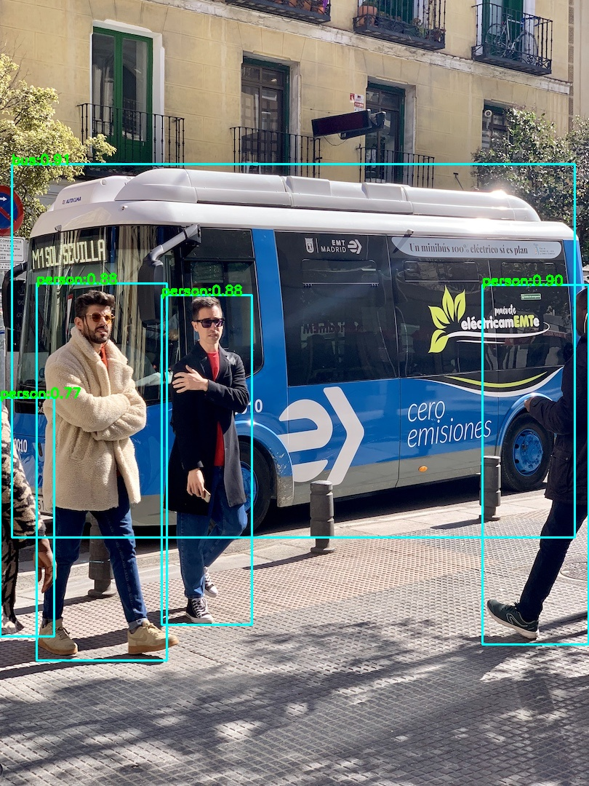
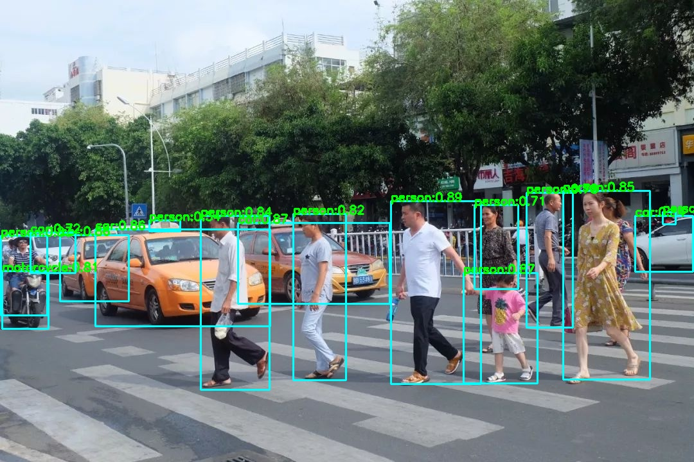
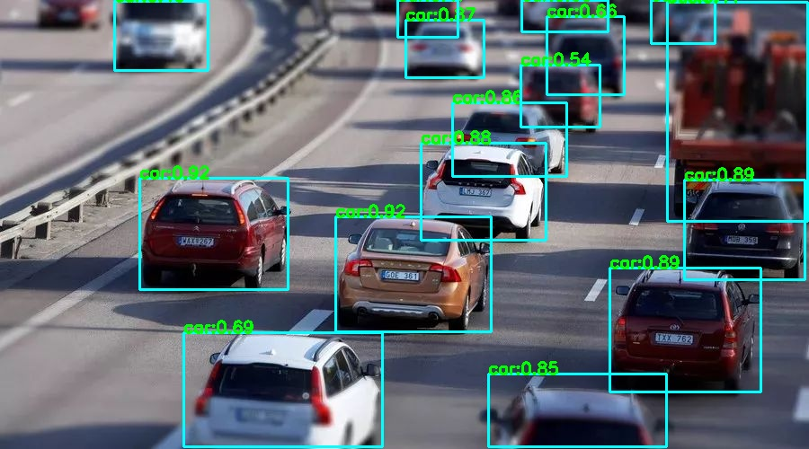
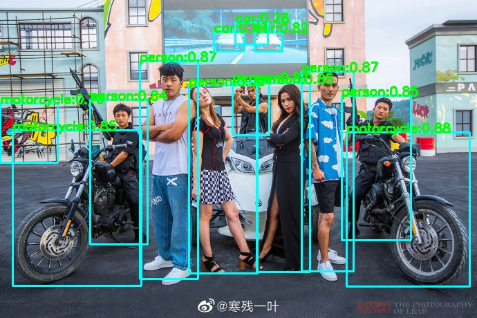
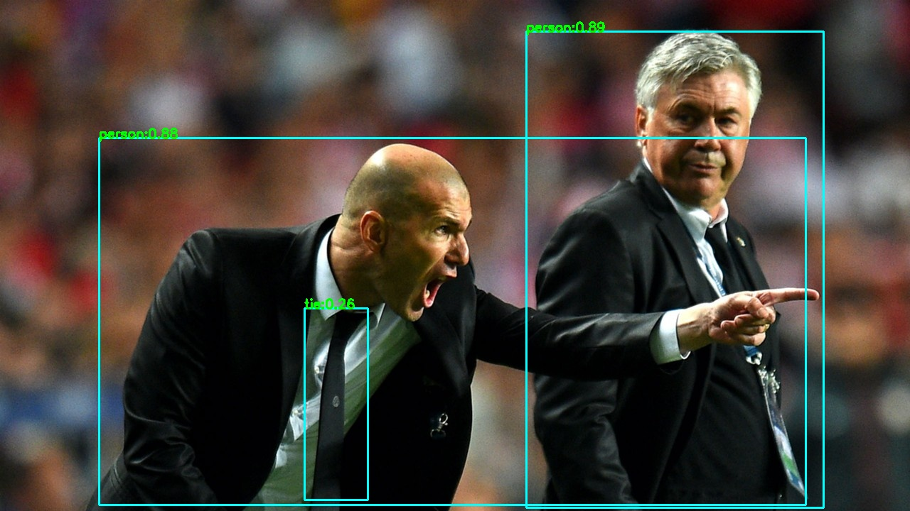
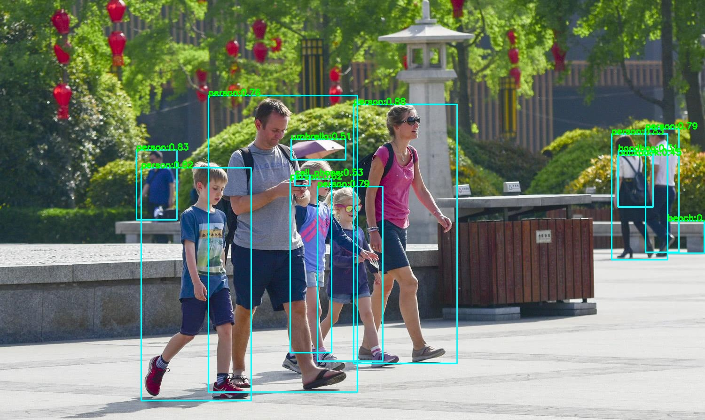
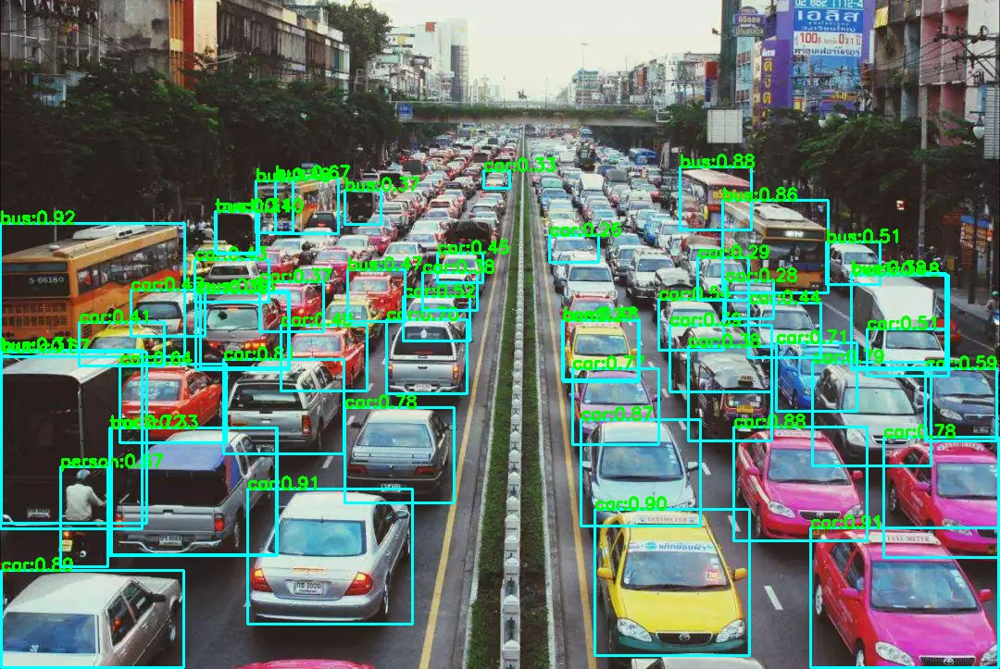
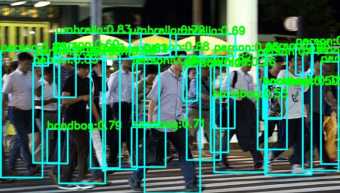

# yolox.lite.ai.toolkit
使用Lite.AI.ToolKit 🚀🚀🌟 C++工具箱来跑YOLOX的一些案例(https://github.com/DefTruth/lite.ai.toolkit) , 包含ONNXRuntime C++、MNN和TNN版本。

<div align='center'>
  
  
  
  

</div>   

若是有用，❤️不妨给个⭐️🌟支持一下吧~ 🙃🤪🍀

## 2. C++版本源码

YOLOX C++ 版本的源码包含ONNXRuntime、MNN和TNN三个版本，可以在 [lite.ai.toolkit](https://github.com/DefTruth/lite.ai.toolkit) 工具箱中找到。本项目主要介绍如何基于 [lite.ai.toolkit](https://github.com/DefTruth/lite.ai.toolkit) 工具箱，直接使用YOLOX来跑目标检测。需要说明的是，本项目是基于MacOS下编译的 [liblite.ai.toolkit.v0.1.0.dylib](https://github.com/DefTruth/nanodet.lite.ai.toolkit/blob/main/lite.ai.toolkit/lib) 来实现的，对于使用MacOS的用户，可以直接下载本项目包含的*liblite.ai.toolkit.v0.1.0*动态库和其他依赖库进行使用。而非MacOS用户，则需要从[lite.ai.toolkit](https://github.com/DefTruth/lite.ai.toolkit) 中下载源码进行编译。[lite.ai.toolkit](https://github.com/DefTruth/lite.ai.toolkit) c++工具箱目前包含70+流行的开源模型。
* [yolox.cpp](https://github.com/DefTruth/lite.ai.toolkit/blob/main/lite/ort/cv/yolox.cpp)
* [yolox.h](https://github.com/DefTruth/lite.ai.toolkit/blob/main/lite/ort/cv/yolox.h)
* [mnn_yolox.cpp](https://github.com/DefTruth/lite.ai.toolkit/blob/main/lite/mnn/cv/mnn_yolox.cpp)
* [mnn_yolox.h](https://github.com/DefTruth/lite.ai.toolkit/blob/main/lite/mnn/cv/mnn_yolox.h)
* [tnn_yolox.cpp](https://github.com/DefTruth/lite.ai.toolkit/blob/main/lite/tnn/cv/tnn_yolox.cpp)
* [tnn_yolox.h](https://github.com/DefTruth/lite.ai.toolkit/blob/main/lite/tnn/cv/tnn_yolox.h)

ONNXRuntime C++、MNN和TNN版本的推理实现均已测试通过，欢迎白嫖~  


## 3. 模型文件

### 3.1 ONNX模型文件
可以从我提供的链接下载 ([Baidu Drive](https://pan.baidu.com/s/1elUGcx7CZkkjEoYhTMwTRQ) code: 8gin) , 也可以从本直接仓库下载。


|                 Class                 |      Pretrained ONNX Files      |              Rename or Converted From (Repo)              | Size  |
| :-----------------------------------: | :-----------------------------: | :-------------------------------------------------------: | :---: |  
|     *lite::cv::detection::YoloX*      |          yolox_x.onnx           |  [YOLOX](https://github.com/Megvii-BaseDetection/YOLOX)   | 378Mb |
|     *lite::cv::detection::YoloX*      |          yolox_l.onnx           |  [YOLOX](https://github.com/Megvii-BaseDetection/YOLOX)   | 207Mb |
|     *lite::cv::detection::YoloX*      |          yolox_m.onnx           |  [YOLOX](https://github.com/Megvii-BaseDetection/YOLOX)   | 97Mb  |
|     *lite::cv::detection::YoloX*      |          yolox_s.onnx           |  [YOLOX](https://github.com/Megvii-BaseDetection/YOLOX)   | 34Mb  |
|     *lite::cv::detection::YoloX*      |         yolox_tiny.onnx         |  [YOLOX](https://github.com/Megvii-BaseDetection/YOLOX)   | 19Mb  |
|     *lite::cv::detection::YoloX*      |         yolox_nano.onnx         |  [YOLOX](https://github.com/Megvii-BaseDetection/YOLOX)   | 3.5Mb |


### 3.2 MNN模型文件
MNN模型文件下载地址，([Baidu Drive](https://pan.baidu.com/s/1KyO-bCYUv6qPq2M8BH_Okg) code: 9v63), 也可以从本直接仓库下载。

|                 Class                 |      Pretrained MNN Files      |              Rename or Converted From (Repo)              | Size  |
| :-----------------------------------: | :-----------------------------: | :-------------------------------------------------------: | :---: |
|    *lite::mnn::cv::detection::YoloX*      |          yolox_x.mnn           |  [YOLOX](https://github.com/Megvii-BaseDetection/YOLOX)   | 378Mb |
|     *lite::mnn::cv::detection::YoloX*      |          yolox_l.mnn           |  [YOLOX](https://github.com/Megvii-BaseDetection/YOLOX)   | 207Mb |
|     *lite::mnn::cv::detection::YoloX*      |          yolox_m.mnn           |  [YOLOX](https://github.com/Megvii-BaseDetection/YOLOX)   | 97Mb  |
|     *lite::mnn::cv::detection::YoloX*      |          yolox_s.mnn           |  [YOLOX](https://github.com/Megvii-BaseDetection/YOLOX)   | 34Mb  |
|     *lite::mnn::cv::detection::YoloX*      |         yolox_tiny.mnn         |  [YOLOX](https://github.com/Megvii-BaseDetection/YOLOX)   | 19Mb  |
|     *lite::mnn::cv::detection::YoloX*      |         yolox_nano.mnn         |  [YOLOX](https://github.com/Megvii-BaseDetection/YOLOX)   | 3.5Mb |


### 3.3 TNN模型文件
TNN模型文件下载地址，([Baidu Drive](https://pan.baidu.com/s/1lvM2YKyUbEc5HKVtqITpcw) code: 6o6k), 也可以从本直接仓库下载。

|                 Class                 |      Pretrained TNN Files      |              Rename or Converted From (Repo)              | Size  |
| :-----------------------------------: | :-----------------------------: | :-------------------------------------------------------: | :---: |
|     *lite::tnn::cv::detection::YoloX*      |          yolox_x.opt.tnnproto&tnnmodel           |  [YOLOX](https://github.com/Megvii-BaseDetection/YOLOX)   | 378Mb |
|     *lite::tnn::cv::detection::YoloX*      |          yolox_l.opt.tnnproto&tnnmodel           |  [YOLOX](https://github.com/Megvii-BaseDetection/YOLOX)   | 207Mb |
|     *lite::tnn::cv::detection::YoloX*      |          yolox_m.opt.tnnproto&tnnmodel           |  [YOLOX](https://github.com/Megvii-BaseDetection/YOLOX)   | 97Mb  |
|     *lite::tnn::cv::detection::YoloX*      |          yolox_s.opt.tnnproto&tnnmodel           |  [YOLOX](https://github.com/Megvii-BaseDetection/YOLOX)   | 34Mb  |
|     *lite::tnn::cv::detection::YoloX*      |         yolox_tiny.opt.tnnproto&tnnmodel         |  [YOLOX](https://github.com/Megvii-BaseDetection/YOLOX)   | 19Mb  |
|     *lite::tnn::cv::detection::YoloX*      |         yolox_nano.opt.tnnproto&tnnmodel         |  [YOLOX](https://github.com/Megvii-BaseDetection/YOLOX)   | 3.5Mb |

## 4. 接口文档

在[lite.ai.toolkit](https://github.com/DefTruth/lite.ai.toolkit) 中，nanodet的实现类为：

```c++
class LITE_EXPORTS lite::cv::detection::YoloX;
class LITE_EXPORTS lite::mnn::cv::detection::YoloX;
class LITE_EXPORTS lite::tnn::cv::detection::YoloX;
```  

该类型目前包含1公共接口`detect`用于进行目标检测。
```c++
public:
    /**
     * @param mat cv::Mat BGR format
     * @param detected_boxes vector of Boxf to catch detected boxes.
     * @param score_threshold default 0.45f, only keep the result which >= score_threshold.
     * @param iou_threshold default 0.3f, iou threshold for NMS.
     * @param topk default 100, maximum output boxes after NMS.
     * @param nms_type the method.
     */
    void detect(const cv::Mat &mat, std::vector<types::Boxf> &detected_boxes,
                float score_threshold = 0.45f, float iou_threshold = 0.3f,
                unsigned int topk = 100, unsigned int nms_type = NMS::OFFSET);
```
`detect`接口的输入参数说明：
* mat: cv::Mat类型，BGR格式。
* detected_boxes: Boxf向量，包含被检测到的框，Boxf中包含x1,y1,x2,y2,label,score等成员
* score_threshold：分类得分（质量得分）阈值，默认0.45，小于该阈值的框将被丢弃。
* iou_threshold：NMS中的iou阈值，默认0.3。
* topk：默认100，只保留前k个检测到的结果。
* nms_type：NMS算法的类型，默认为不同的类别各自做NMS。

## 5. 使用案例
这里测试使用的是yolox_s.onnx版本(20210819之前)的模型，你可以尝试使用其他版本的模型。

### 5.1 ONNXRuntime版本
```c++
#include "lite/lite.h"

static void test_default()
{
    std::string onnx_path = "../hub/onnx/cv/yolox_s.onnx";
    std::string test_img_path = "../resources/5.jpg";
    std::string save_img_path = "../logs/5.jpg";
    
    // 1. Test Default Engine ONNXRuntime
    auto *yolox = new lite::cv::detection::YoloX(onnx_path); // default
    
    std::vector<lite::types::Boxf> detected_boxes;
    cv::Mat img_bgr = cv::imread(test_img_path);
    yolox->detect(img_bgr, detected_boxes);
    
    lite::utils::draw_boxes_inplace(img_bgr, detected_boxes);
    
    cv::imwrite(save_img_path, img_bgr);
    
    std::cout << "Default Version Detected Boxes Num: " << detected_boxes.size() << std::endl;
    
    delete yolox;
}
```  

### 5.2 MNN版本
```c++
#include "lite/lite.h"

static void test_mnn()
{
#ifdef ENABLE_MNN
    std::string mnn_path = "../hub/mnn/cv/yolox_s.mnn";
    std::string test_img_path = "../resources/7.jpg";
    std::string save_img_path = "../logs/7.jpg";
    
    // 3. Test Specific Engine MNN
    auto *yolox = new lite::mnn::cv::detection::YoloX(mnn_path);
    
    std::vector<lite::types::Boxf> detected_boxes;
    cv::Mat img_bgr = cv::imread(test_img_path);
    yolox->detect(img_bgr, detected_boxes);
    
    lite::utils::draw_boxes_inplace(img_bgr, detected_boxes);
    
    cv::imwrite(save_img_path, img_bgr);
    
    std::cout << "MNN Version Detected Boxes Num: " << detected_boxes.size() << std::endl;
    
    delete yolox;
#endif
}
```  

### 5.3 TNN版本
```c++
#include "lite/lite.h"

static void test_tnn()
{
#ifdef ENABLE_TNN
    std::string proto_path = "../hub/tnn/cv/yolox_s.opt.tnnproto";
    std::string model_path = "../hub/tnn/cv/yolox_s.opt.tnnmodel";
    std::string test_img_path = "../resources/9.jpg";
    std::string save_img_path = "../logs/9.jpg";
    
    // 5. Test Specific Engine TNN
    auto *yolox = new lite::tnn::cv::detection::YoloX(proto_path, model_path);
    
    std::vector<lite::types::Boxf> detected_boxes;
    cv::Mat img_bgr = cv::imread(test_img_path);
    yolox->detect(img_bgr, detected_boxes);
    
    lite::utils::draw_boxes_inplace(img_bgr, detected_boxes);
    
    cv::imwrite(save_img_path, img_bgr);
    
    std::cout << "TNN Version Detected Boxes Num: " << detected_boxes.size() << std::endl;
    
    delete yolox;
#endif
}
```  

* 输出结果为:
<div align='center'>
  
  
  
  
  <br>  
  
  
  
  
</div>   

## 6. 编译运行
在MacOS下可以直接编译运行本项目，无需下载其他依赖库。其他系统则需要从[lite.ai.toolkit](https://github.com/DefTruth/lite.ai.toolkit) 中下载源码先编译*lite.ai.toolkit.v0.1.0*动态库。
```shell
git clone --depth=1 https://github.com/DefTruth/yolox.lite.ai.toolkit.git
cd yolox.lite.ai.toolkit 
sh ./build.sh
```  

* CMakeLists.txt设置
```cmake
cmake_minimum_required(VERSION 3.17)
project(yolox.lite.ai.toolkit)

set(CMAKE_CXX_STANDARD 11)

# setting up lite.ai.toolkit
set(LITE_AI_DIR ${CMAKE_SOURCE_DIR}/lite.ai.toolkit)
set(LITE_AI_INCLUDE_DIR ${LITE_AI_DIR}/include)
set(LITE_AI_LIBRARY_DIR ${LITE_AI_DIR}/lib)
include_directories(${LITE_AI_INCLUDE_DIR})
link_directories(${LITE_AI_LIBRARY_DIR})

set(OpenCV_LIBS
        opencv_highgui
        opencv_core
        opencv_imgcodecs
        opencv_imgproc
        opencv_video
        opencv_videoio
        )
# add your executable
set(EXECUTABLE_OUTPUT_PATH ${CMAKE_SOURCE_DIR}/examples/build)

add_executable(lite_yolox examples/test_lite_yolox.cpp)
target_link_libraries(lite_yolox
        lite.ai.toolkit
        onnxruntime
        MNN  # need, if built lite.ai.toolkit with ENABLE_MNN=ON,  default OFF
        ncnn # need, if built lite.ai.toolkit with ENABLE_NCNN=ON, default OFF
        TNN  # need, if built lite.ai.toolkit with ENABLE_TNN=ON,  default OFF
        ${OpenCV_LIBS})  # link lite.ai.toolkit & other libs.
```

* building && testing information:
```shell
[ 50%] Building CXX object CMakeFiles/lite_yolox.dir/examples/test_lite_yolox.cpp.o
[100%] Linking CXX executable lite_yolox
[100%] Built target lite_yolox
Testing Start ...
LITEORT_DEBUG LogId: ../hub/onnx/cv/yolox_s.onnx
=============== Input-Dims ==============
input_node_dims: 1
input_node_dims: 3
input_node_dims: 640
input_node_dims: 640
=============== Output-Dims ==============
Output: 0 Name: outputs Dim: 0 :1
Output: 0 Name: outputs Dim: 1 :8400
Output: 0 Name: outputs Dim: 2 :85
========================================
detected num_anchors: 8400
generate_bboxes num: 343
Default Version Detected Boxes Num: 53
LITEORT_DEBUG LogId: ../hub/onnx/cv/yolox_s.onnx
=============== Input-Dims ==============
input_node_dims: 1
input_node_dims: 3
input_node_dims: 640
input_node_dims: 640
=============== Output-Dims ==============
Output: 0 Name: outputs Dim: 0 :1
Output: 0 Name: outputs Dim: 1 :8400
Output: 0 Name: outputs Dim: 2 :85
========================================
detected num_anchors: 8400
generate_bboxes num: 181
ONNXRuntime Version Detected Boxes Num: 26
LITEMNN_DEBUG LogId: ../hub/mnn/cv/yolox_s.mnn
=============== Input-Dims ==============
        **Tensor shape**: 1, 3, 640, 640, 
Dimension Type: (CAFFE/PyTorch/ONNX)NCHW
=============== Output-Dims ==============
getSessionOutputAll done!
Output: outputs:        **Tensor shape**: 1, 8400, 85, 
========================================
detected num_anchors: 8400
generate_bboxes num: 138
MNN Version Detected Boxes Num: 16
LITETNN_DEBUG LogId: ../hub/tnn/cv/yolox_s.opt.tnnproto
=============== Input-Dims ==============
inputs: [1 3 640 640 ]
Input Data Format: NCHW
=============== Output-Dims ==============
outputs: [1 8400 85 1 ]
========================================
detected num_anchors: 8400
generate_bboxes num: 113
TNN Version Detected Boxes Num: 13
Testing Successful !
```  


